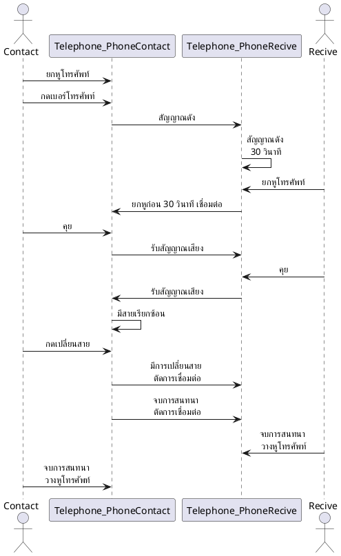

```puml
@startuml 
skinparam sequenceMessageAlign center
actor Contact
participant Telephone_PhoneContact
participant Telephone_PhoneRecive
actor Recive
Contact->Telephone_PhoneContact:ยกหูโทรศัพท์
Contact->Telephone_PhoneContact:กดเบอร์โทรศัพท์
Telephone_PhoneContact->Telephone_PhoneRecive:สัญญาณดัง
Telephone_PhoneRecive->Telephone_PhoneRecive:สัญญาณดัง \n30 วินาที
Recive->Telephone_PhoneRecive:ยกหูโทรศัพท์
Telephone_PhoneRecive->Telephone_PhoneContact:ยกหูก่อน 30 วินาที เชื่อมต่อ
Contact->Telephone_PhoneContact:คุย
Telephone_PhoneContact->Telephone_PhoneRecive:รับสัญญาณเสียง
Recive->Telephone_PhoneRecive:คุย
Telephone_PhoneRecive->Telephone_PhoneContact:รับสัญญาณเสียง
Telephone_PhoneContact->Telephone_PhoneContact:มีสายเรียกซ้อน
Contact->Telephone_PhoneContact:กดเปลี่ยนสาย
Telephone_PhoneContact->Telephone_PhoneRecive:มีการเปลี่ยนสาย \nตัดการเชื่อมต่อ
Telephone_PhoneContact->Telephone_PhoneRecive:จบการสนทนา \nตัดการเชื่อมต่อ
Recive->Telephone_PhoneRecive:จบการสนทนา \nวางหูโทรศัพท์
Contact->Telephone_PhoneContact:จบการสนทนา \nวางหูโทรศัพท์
@enduml
```
